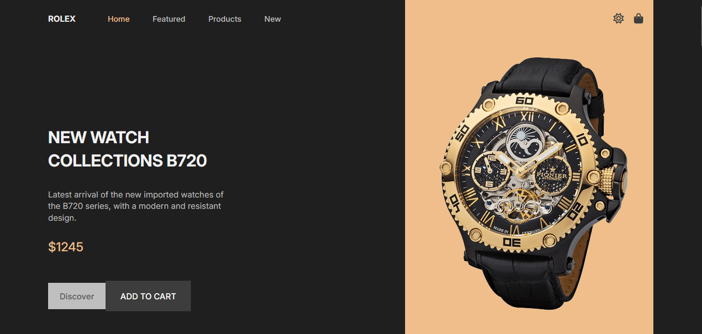
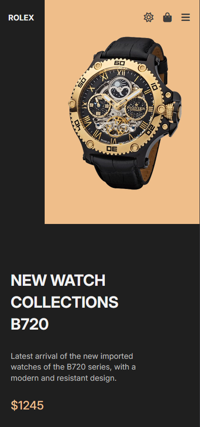
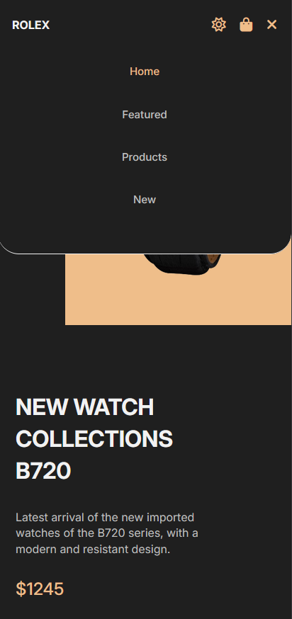

# ROLEX-website
This project is a fully responsive website developed using Pug (template engine), SCSS (modular styling), and vanilla JavaScript. The code follows clean architecture principles, using mixins, variables, and reusable UI components. It includes custom animations, responsive layout adjustments, and a dynamic theme-switching system.

## 🛠️🧰 Tech Stack
- Pug (templating)
- SCSS (styling)
- Vanilla JavaScript (interactivity)
- Theme Switch (light/dark) 
- Responsive Design  
- Font Awesome (icons)

## 🟢 Live Demo
View the website online:  
👉 https://hamza-leon120.github.io/ROLEX-website/

## 📸 Screenshots

### 🌞 Light Mode


### 🌙 Dark Mode


### 📱 mobail


### mobail slaider 


## ✨ Features  
- Fully responsive design (mobile / tablet / desktop)  
- Light / Dark theme toggle (persistent across sessions)  
- Product grid, featured products, new arrivals, testimonials, newsletter section, etc.  
- Clean, modular SCSS using variables & mixins  
- Vanilla JS for interactivity: theme toggle, mobile menu, “scroll to top” button, card hover states, testimonial slider

## 🛠️ How to Run Locally
```bash
git clone https://github.com/hamza-leon120/ROLEX-website.git
cd ROLEX-website
open index.html
