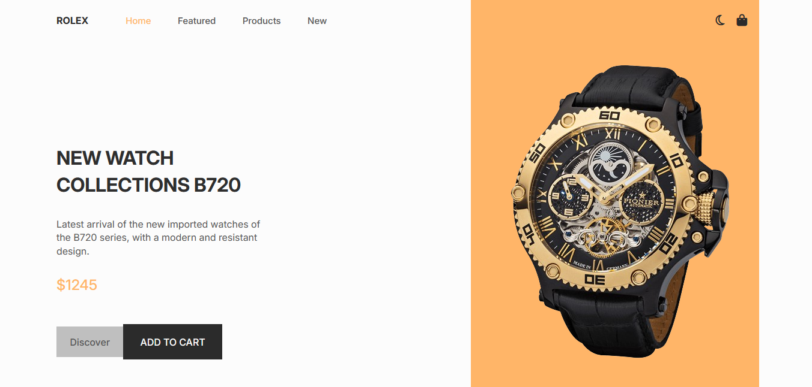
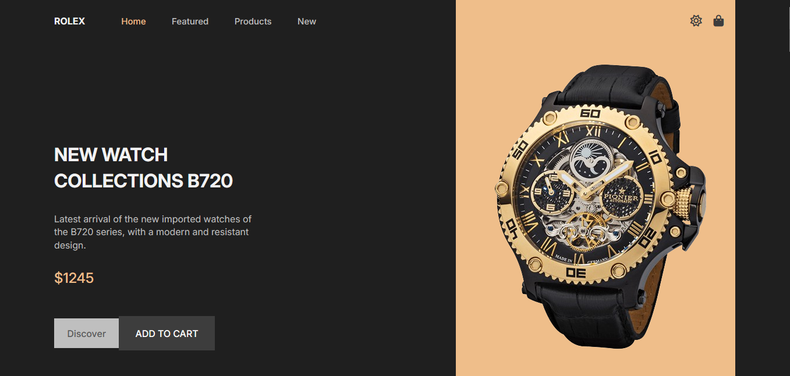
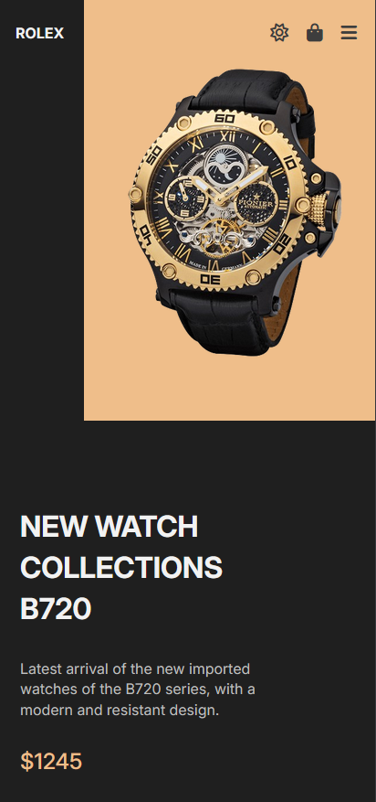
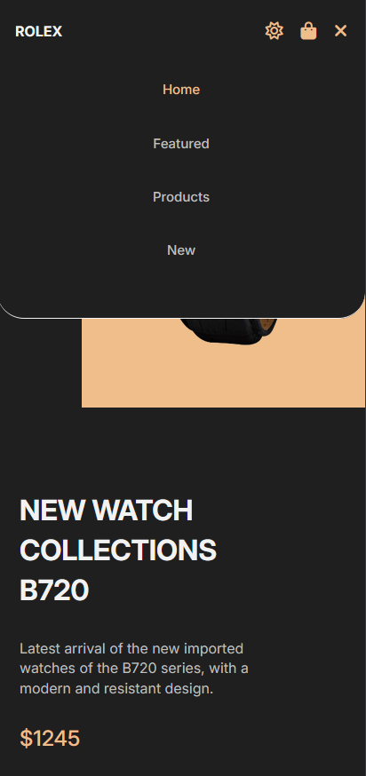

# ⌚ ROLEX Website

> A fully responsive luxury watch website built with Pug, SCSS, and vanilla JavaScript. Features a dynamic light/dark theme toggle, smooth animations, testimonial slider, and clean modular code architecture.

[](https://hamza-leon120.github.io/ROLEX-website/)
[](https://github.com/hamza-leon120/ROLEX-website)
[](LICENSE)

---

## 🚀 Live Demo

👉 [https://hamza-leon120.github.io/ROLEX-website/](https://hamza-leon120.github.io/ROLEX-website/)

---

## 📸 Preview

### 🌞 Light Mode


### 🌙 Dark Mode


### 📱 Mobile View


### 📱 Mobile Slider


---

## ✨ Features

- 🌗 Light / Dark theme toggle — persistent across sessions using localStorage
- 📱 Fully responsive — mobile, tablet, and desktop layouts
- 🎠 Testimonial slider for mobile view
- 🛍️ Product grid with featured products and new arrivals sections
- 📜 Scroll to top button
- 🍔 Mobile navigation menu
- 🎨 Custom animations and hover states
- 🧩 Clean, modular SCSS using variables, mixins, and reusable components
- ✉️ Newsletter subscription section

---

## 🛠️ Built With

| Technology | Purpose |
|------------|---------|
| **Pug** | HTML templating engine |
| **SCSS** | Modular styling with mixins & variables |
| **Vanilla JavaScript** | Theme toggle, slider, menu, animations |
| **Font Awesome** | Icons throughout the UI |
| **GitHub Actions** | CI/CD auto-deployment |
| **GitHub Pages** | Hosting |

---

## 📂 Project Structure

```
ROLEX-website/
├── .github/
│   └── workflows/        # GitHub Actions CI/CD pipeline
├── img/                  # All images and screenshots
├── include/              # Pug partials (header, sections, footer)
├── scss/                 # SCSS source files
│   ├── layout/           # Layout styles
│   └── mixin/            # Reusable mixins
├── webfonts/             # Custom font files
├── .gitignore
├── LICENSE
├── README.md
├── index.html            # Compiled HTML output
├── index.pug             # Pug source template
└── main.js               # JavaScript logic
```

---

## ⚙️ Getting Started

```bash
# 1. Clone the repository
git clone https://github.com/hamza-leon120/ROLEX-website.git

# 2. Navigate into the project folder
cd ROLEX-website

# 3. Open in your browser
open index.html
```

> **Note:** To edit the source, modify `index.pug` and `scss/` files. You'll need a compiler like [Prepros](https://prepros.io/) or a Gulp/Webpack setup to compile Pug → HTML and SCSS → CSS.

---

## 🎨 Theme System

The site includes a fully functional **light/dark mode toggle** built with vanilla JavaScript. The selected theme is saved to `localStorage` so it persists when the user revisits the page — no frameworks needed.

---

## 🔮 Future Improvements

- 🛒 Add a functional shopping cart
- 🔍 Product search and filter by collection
- 🌍 Multi-language support
- ⚡ Performance optimization (lazy loading images)
- ♿ Improved accessibility (ARIA attributes)

---

## 👤 Author

**Aymen (Hamza)**

- 🐙 GitHub: [@hamza-leon120](https://github.com/hamza-leon120)
- 📧 Email: [haaymen20@gmail.com](mailto:haaymen20@gmail.com)
- 🌐 Portfolio: [hamza-leon120.github.io/my-profail](https://hamza-leon120.github.io/my-profail/)

---

## 📄 License

This project is licensed under the [MIT License](LICENSE).

---

<p align="center">Made with ❤️ by <a href="https://github.com/hamza-leon120">Aymen</a></p>
